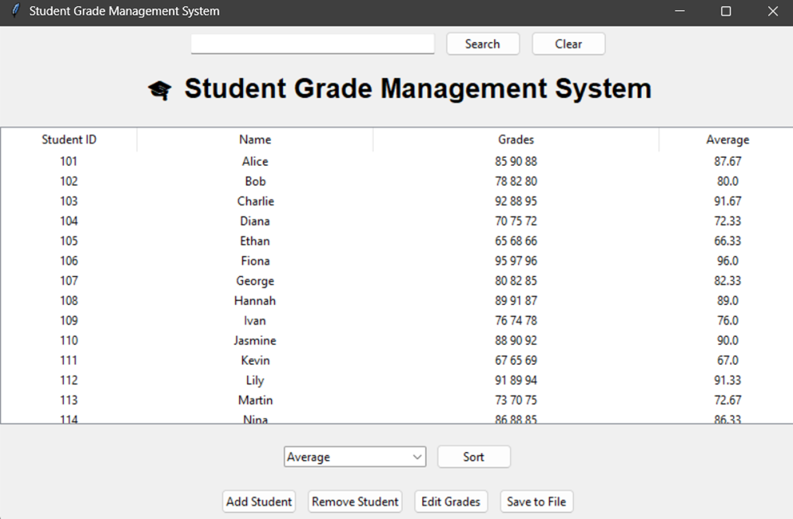
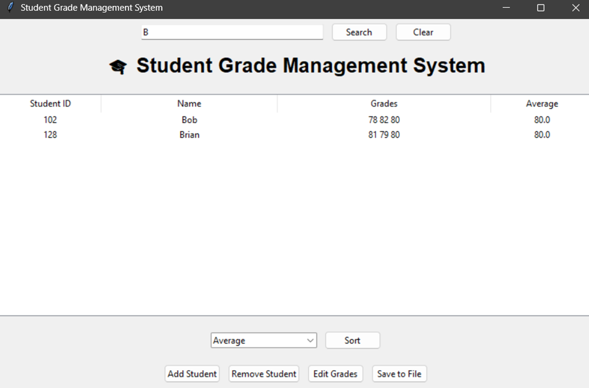

🎓 Student Grade Management System
- A modern, user-friendly Student Grade Management System built with Python and Tkinter. Effortlessly manage student records: add, edit, delete, search, sort, and save student data—all in a clean, attractive graphical interface.
- Features
    - Add Student: Enter student ID, name, and grades in a dedicated pop-up window.

    - Edit Student: Modify a student's name and grades via a structured form.

    - Remove Student: Confirm and delete a student record with a confirmation dialog.

- Search:

    - Search by student ID, full or partial name, or the first letter(s) of the name.

    - Sort: Sort students by ID, name, or average grade.

    - Save/Load: Data is automatically loaded from and can be saved to a students.json file.

    - Attractive UI: Clean, modern interface with pop-up forms for all major actions.

Screenshots



- Getting Started
Prerequisites

    - Python 3.x
    - Tkinter (usually included with Python)
    - No external dependencies required

- Installation
    - Clone or download this repository.

- Ensure students.json is in the same directory (it will be created automatically if not present).

- Running the Application
```bash
python StudentGrade.py
```
- Usage
    - Main Window
Search Bar: Enter a student ID, name, or the first letter(s) of a name and click "Search".

- Sort: Choose a sort option and click "Sort".

- Add/Edit/Remove: Use the buttons to open pop-up windows for each operation.

- Save to File: Click to save all current data to students.json.

- Add Student
- Opens a new window.

- Enter a unique student ID, name, and grades (space-separated).

- Click "Add" to save.

- Edit Student
- Select a student in the table and click "Edit Student".

- Modify the name and/or grades.

- Click "Update" to save changes.

- Remove Student
Select a student and click "Remove Student".

- Confirm deletion in the pop-up dialog.

- Data Format
Student data is stored in students.json as a list of objects:

    - json
    ``` [
    {
        "student_id": 1,
        "name": "Alice",
        "grades": [90, 85, 88],
        "average": 87.67
    },
    ...
    ]
    ```
- Customization
    - UI: You can further enhance the look by customizing fonts, colors, and adding icons.

- Validation: The app checks for duplicate IDs and valid input formats.

- Troubleshooting
    - If the app does not start, ensure you are using Python 3 and Tkinter is installed.

    - If you encounter permission issues with students.json, check your file/folder permissions.

- License
    - This project is open source and free to use for educational and personal purposes.

- Author
    - Vimal Kumar Singh


Enjoy managing your students' grades with ease! 🎓